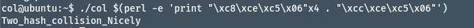

## Pwnable.kr
Target: collision
SSH Connect: ssh col@pwnable.kr -p2222 (pw:guest)

### Code Overview
```
#include <stdio.h>
#include <string.h>
unsigned long hashcode = 0x21DD09EC;
unsigned long check_password(const char* p){
	int* ip = (int*)p;
	int i;
	int res=0;
	for(i=0; i<5; i++){
		res += ip[i];
	}
	return res;
}

int main(int argc, char* argv[]){
	if(argc<2){
		printf("usage : %s [passcode]\n", argv[0]);
		return 0;
	}
	if(strlen(argv[1]) != 20){
		printf("passcode length should be 20 bytes\n");
		return 0;
	}

	if(hashcode == check_password( argv[1] )){
		setregid(getegid(), getegid());
		system("/bin/cat flag");
		return 0;
	}
	else
		printf("wrong passcode.\n");
	return 0;
}
```

### Solution
Inside the check_password function, the char pointer is typecasting into integer pointer
As we know, char occupied 1 byte whereas integer pointer occupied 4 bytes

All we need to do is to divide 0x21DD09EC into 5 parts then sum it up
Since 0x21DD09EC is not divisible by 5, therefore we will do 4 + 1


### Answer
./col $(perl -e 'print "\xc8\xce\xc5\x06"x4 . "\xcc\xce\xc5\x06"')

### Result
