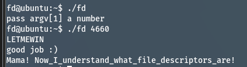

## Pwnable.kr
Target: fd
SSH Connect: ssh fd@pwnable.kr -p2222 (pw:guest)

### Code Overview
```
#include <stdio.h>
#include <stdlib.h>
#include <string.h>
char buf[32];
int main(int argc, char* argv[], char* envp[]){
	if(argc<2){
		printf("pass argv[1] a number\n");
		return 0;
	}
	int fd = atoi( argv[1] ) - 0x1234;
	int len = 0;
	len = read(fd, buf, 32);
	if(!strcmp("LETMEWIN\n", buf)){
		printf("good job :)\n");
		setregid(getegid(), getegid());
		system("/bin/cat flag");
		exit(0);
	}
	printf("learn about Linux file IO\n");
	return 0;
}
```
### Solution
Since we need to ensure that buf contains strings "LETMEWIN" to get into the if condition,
Maybe we could just insert strings to the buf with STDIN(0)
if the fd is 0, then the read function should prompt user to input smtg into buf
That's it

### Answers
./fd 4660
LETMEWIN

### Result


