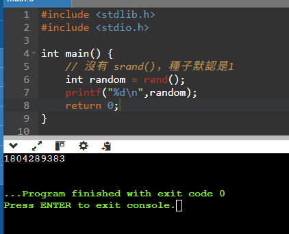

## Pwnable.kr
Target: random <br>
SSH Connect: ssh random@pwnable.kr -p2222 (pw:guest)

### Code Overview
```
#include <stdio.h>

int main(){
	unsigned int random;
	random = rand();	// random value!

	unsigned int key=0;
	scanf("%d", &key);

	if( (key ^ random) == 0xcafebabe ){
		printf("Good!\n");
		setregid(getegid(), getegid());
		system("/bin/cat flag");
		return 0;
	}

	printf("Wrong, maybe you should try 2^32 cases.\n");
	return 0;
}

```

### Solution
It is apparent that the random numbers generated is pseudo-random. As it doesn't write srand() to provide a seed.
The random number generated is always the same. We can try to generate it ourself.



1804289383 is 0x6B8B4567 in hex


### Answer
m0mmy_I_can_predict_rand0m_v4lue!

### Result
```
random@ubuntu:~$ ./random
2708864985
Good!
m0mmy_I_can_predict_rand0m_v4lue!


```
